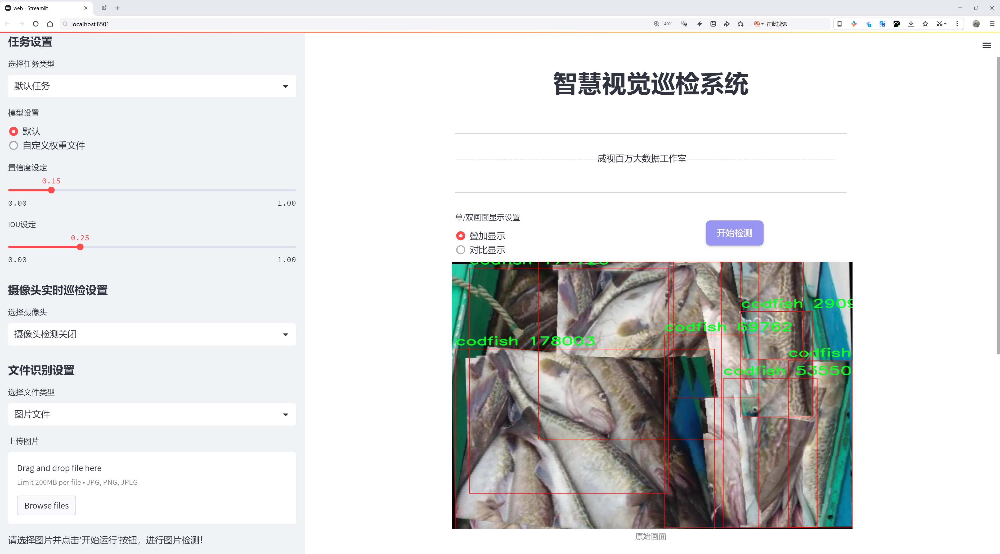
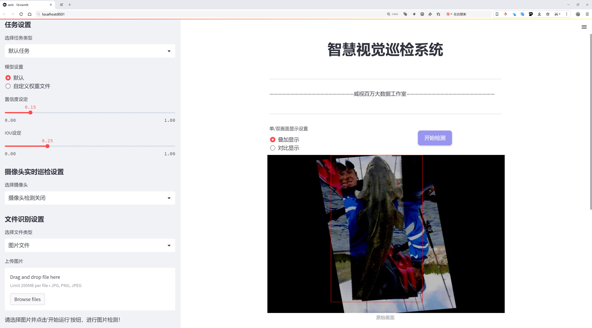
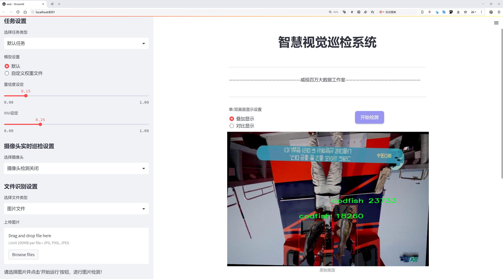
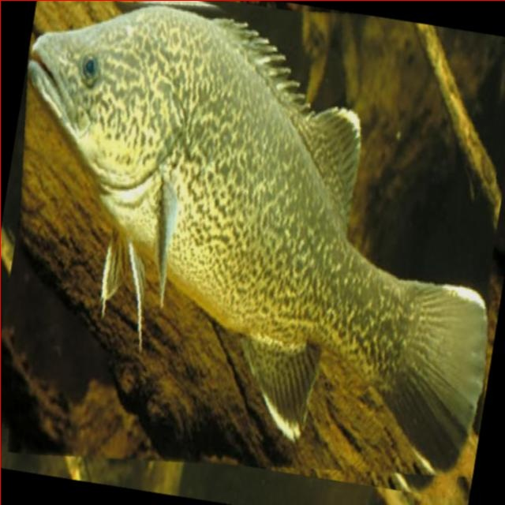
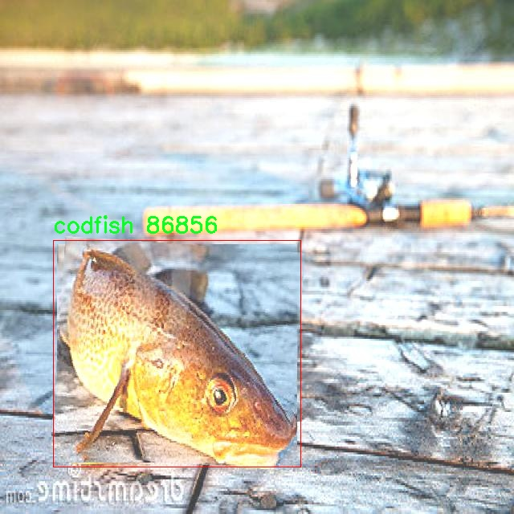
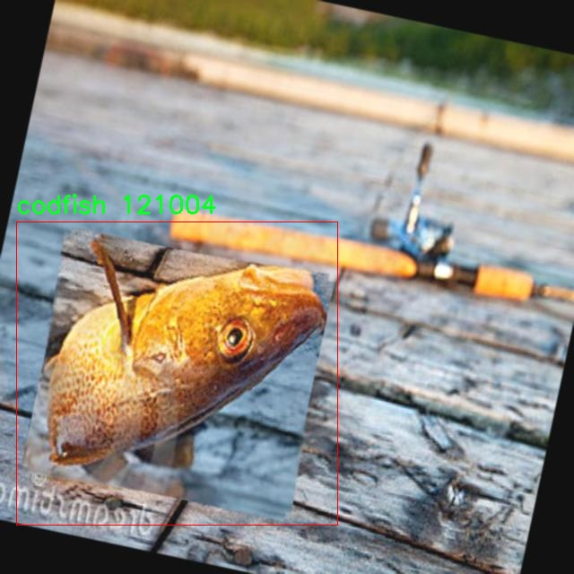
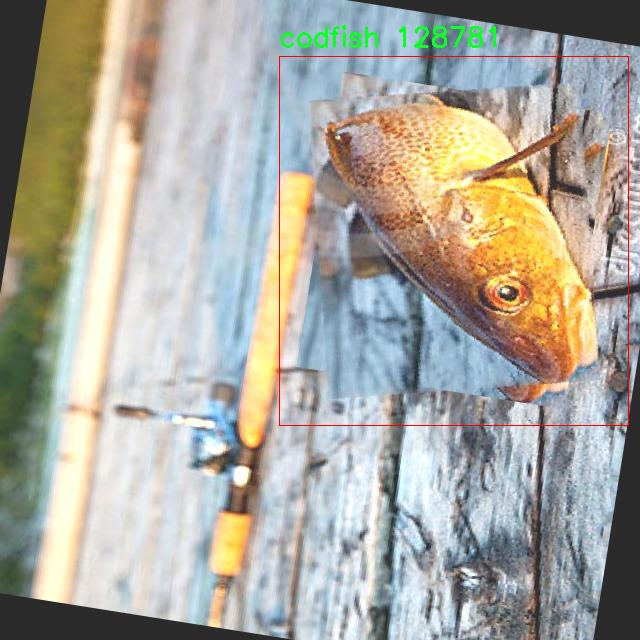
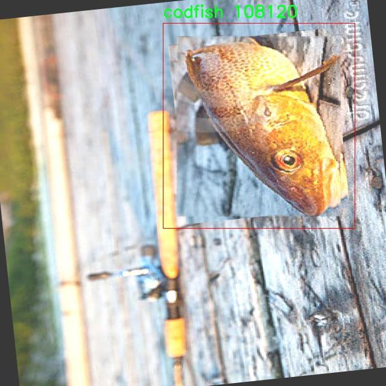

# 鳕鱼检测检测系统源码分享
 # [一条龙教学YOLOV8标注好的数据集一键训练_70+全套改进创新点发刊_Web前端展示]

### 1.研究背景与意义

项目参考[AAAI Association for the Advancement of Artificial Intelligence](https://gitee.com/qunmasj/projects)

项目来源[AACV Association for the Advancement of Computer Vision](https://kdocs.cn/l/cszuIiCKVNis)

研究背景与意义

随着全球渔业资源的日益枯竭，科学合理的渔业管理和可持续捕捞成为亟待解决的重要课题。鳕鱼作为一种经济价值较高的海洋鱼类，其捕捞和养殖的管理尤为重要。然而，传统的鳕鱼检测方法往往依赖于人工观察和经验判断，效率低下且容易受到主观因素的影响。为了解决这一问题，基于深度学习的目标检测技术逐渐被引入到鳕鱼检测领域，展现出良好的应用前景。

YOLO（You Only Look Once）系列模型因其快速和高效的目标检测能力，已成为计算机视觉领域的重要工具。特别是YOLOv8，作为该系列的最新版本，结合了更为先进的网络结构和算法优化，能够在保证检测精度的同时大幅提升处理速度。针对鳕鱼这一特定目标，改进YOLOv8模型的应用，将为实现高效、准确的鳕鱼检测提供技术支持。

本研究的核心在于构建一个基于改进YOLOv8的鳕鱼检测系统。我们将利用一个包含1700张鳕鱼图像的数据集进行模型训练和测试。该数据集专注于鳕鱼这一单一类别，能够为模型提供清晰的目标特征，确保检测的准确性和可靠性。通过对数据集的深入分析，我们将探索鳕鱼在不同环境、不同姿态下的特征表现，进而优化模型的参数设置和训练策略。

本研究的意义不仅在于提升鳕鱼检测的技术水平，更在于推动智能化渔业管理的发展。通过实现自动化的鳕鱼检测，渔业管理者能够实时监控鳕鱼的捕捞情况，科学评估鳕鱼资源的变化趋势，从而制定更为合理的捕捞政策。此外，改进YOLOv8模型的成功应用也为其他海洋生物的检测提供了借鉴，具有广泛的推广价值。

在全球渔业资源保护和可持续发展的大背景下，本研究将为鳕鱼的科学管理提供新的思路和方法。通过技术创新与实践应用的结合，我们期望能够为渔业的可持续发展贡献一份力量。同时，研究成果也将为相关领域的学术研究提供新的数据支持和理论基础，推动计算机视觉技术在生态保护和资源管理中的应用。

综上所述，基于改进YOLOv8的鳕鱼检测系统的研究不仅具有重要的学术价值，也具备显著的社会意义。通过提升鳕鱼检测的效率和准确性，我们将为渔业的可持续发展提供切实可行的解决方案，推动智能渔业的实现，助力生态环境的保护与恢复。

### 2.图片演示







##### 注意：由于此博客编辑较早，上面“2.图片演示”和“3.视频演示”展示的系统图片或者视频可能为老版本，新版本在老版本的基础上升级如下：（实际效果以升级的新版本为准）

  （1）适配了YOLOV8的“目标检测”模型和“实例分割”模型，通过加载相应的权重（.pt）文件即可自适应加载模型。

  （2）支持“图片识别”、“视频识别”、“摄像头实时识别”三种识别模式。

  （3）支持“图片识别”、“视频识别”、“摄像头实时识别”三种识别结果保存导出，解决手动导出（容易卡顿出现爆内存）存在的问题，识别完自动保存结果并导出到tempDir中。

  （4）支持Web前端系统中的标题、背景图等自定义修改，后面提供修改教程。

  另外本项目提供训练的数据集和训练教程,暂不提供权重文件（best.pt）,需要您按照教程进行训练后实现图片演示和Web前端界面演示的效果。

### 3.视频演示

[3.1 视频演示](https://www.bilibili.com/video/BV1BYsfeQERA/)

### 4.数据集信息展示

##### 4.1 本项目数据集详细数据（类别数＆类别名）

nc: 1
names: ['codfish']


##### 4.2 本项目数据集信息介绍

数据集信息展示

在本研究中，我们采用了名为“cod_fish”的数据集，以支持对YOLOv8模型的改进，专注于鳕鱼的检测系统。该数据集专门针对鳕鱼这一特定类别进行构建，具有高度的针对性和专业性。数据集的类别数量为1，类别列表中仅包含“codfish”这一项。这种简化的类别设置使得模型在训练过程中能够集中精力于鳕鱼的特征提取与识别，避免了多类别干扰所带来的复杂性。

“cod_fish”数据集的构建过程经过精心设计，旨在确保数据的多样性和代表性。数据集中包含了多种不同环境下的鳕鱼图像，这些图像来源于不同的捕捞场景和水域条件，涵盖了鳕鱼在自然栖息地中的多种姿态和状态。这种多样性不仅有助于提高模型的泛化能力，还能增强其在实际应用中的适应性。数据集中鳕鱼的图像经过精细标注，确保每一张图像中的鳕鱼都被准确框定，提供了清晰的边界框信息。这对于训练YOLOv8模型至关重要，因为精确的标注能够显著提高模型的检测精度。

在数据预处理阶段，我们对图像进行了多种增强处理，包括旋转、缩放、翻转等操作，以增加数据集的有效样本数量。这种数据增强策略能够帮助模型更好地学习鳕鱼的不同特征，提升其在不同情况下的检测能力。此外，数据集中还包含了不同光照条件和水质状态下的鳕鱼图像，进一步丰富了模型的训练数据，使其能够在多变的环境中保持高效的检测性能。

在模型训练过程中，我们将“cod_fish”数据集与YOLOv8的先进特性相结合，利用其强大的特征提取能力和实时检测能力，旨在实现高效、准确的鳕鱼检测。YOLOv8的架构允许我们在保持高检测速度的同时，提升检测精度，这对于实际应用中的实时监控和捕捞管理具有重要意义。通过对“cod_fish”数据集的深入分析和应用，我们期望能够显著改善现有的鳕鱼检测系统，为渔业管理和生态保护提供有力的技术支持。

总之，“cod_fish”数据集为本研究提供了坚实的基础，其专注于鳕鱼这一单一类别的设计，使得模型训练更加高效。通过对数据集的合理利用，我们希望能够推动YOLOv8在鳕鱼检测领域的应用，提升其在实际场景中的表现。未来，我们还计划对数据集进行扩展，增加更多的鳕鱼图像，以进一步提升模型的性能和适应性，为渔业可持续发展贡献力量。











### 5.全套项目环境部署视频教程（零基础手把手教学）

[5.1 环境部署教程链接（零基础手把手教学）](https://www.ixigua.com/7404473917358506534?logTag=c807d0cbc21c0ef59de5)


[5.2 安装Python虚拟环境创建和依赖库安装视频教程链接（零基础手把手教学）](https://www.ixigua.com/7404474678003106304?logTag=1f1041108cd1f708b01a)

### 6.手把手YOLOV8训练视频教程（零基础小白有手就能学会）

[6.1 手把手YOLOV8训练视频教程（零基础小白有手就能学会）](https://www.ixigua.com/7404477157818401292?logTag=d31a2dfd1983c9668658)

### 7.70+种全套YOLOV8创新点代码加载调参视频教程（一键加载写好的改进模型的配置文件）

[7.1 70+种全套YOLOV8创新点代码加载调参视频教程（一键加载写好的改进模型的配置文件）](https://www.ixigua.com/7404478314661806627?logTag=29066f8288e3f4eea3a4)

### 8.70+种全套YOLOV8创新点原理讲解（非科班也可以轻松写刊发刊，V10版本正在科研待更新）

由于篇幅限制，每个创新点的具体原理讲解就不一一展开，具体见下列网址中的创新点对应子项目的技术原理博客网址【Blog】：


[8.1 70+种全套YOLOV8创新点原理讲解链接](https://gitee.com/qunmasj/good)

### 9.系统功能展示（检测对象为举例，实际内容以本项目数据集为准）

图9.1.系统支持检测结果表格显示

  图9.2.系统支持置信度和IOU阈值手动调节

  图9.3.系统支持自定义加载权重文件best.pt(需要你通过步骤5中训练获得)

  图9.4.系统支持摄像头实时识别

  图9.5.系统支持图片识别

  图9.6.系统支持视频识别

  图9.7.系统支持识别结果文件自动保存

  图9.8.系统支持Excel导出检测结果数据


### 10.原始YOLOV8算法原理

原始YOLOv8算法原理

YOLOv8算法是由Ultralytics公司于2023年1月10日发布的一个重要版本，它在YOLOv7的基础上进行了显著的优化和改进。作为一种基于卷积神经网络（CNN）的目标检测算法，YOLOv8的设计理念是将整个图像作为输入，直接在图像上进行目标检测和定位，而不需要使用传统的滑动窗口或区域提议方法。这种设计使得YOLOv8在检测精度和速度上都得到了显著提升，成为目标检测领域的一个重要里程碑。

YOLOv8采用了更深的卷积神经网络结构，这一改进使得模型能够提取更丰富的特征信息。具体而言，YOLOv8的网络结构由输入端、主干网络、Neck端和输出端四个主要模块组成。输入端负责对输入图像进行预处理，包括Mosaic数据增强、自适应图片缩放和灰度填充等技术，这些技术旨在提高模型的鲁棒性和适应性。主干网络则通过一系列卷积、池化和特征提取操作，提取出图像中的重要特征。特别是，YOLOv8引入了C2f（C2f模块）和SPPF（Spatial Pyramid Pooling Fast）结构，这些结构能够有效地捕捉图像中的多尺度特征，从而提高检测的准确性。

在Neck端，YOLOv8采用了基于路径聚合网络（PAN）的设计，通过上采样和下采样操作，对不同尺度的特征图进行融合。这一过程不仅增强了模型对不同大小目标的检测能力，还提高了特征信息的传递效率。Neck端的设计理念是确保不同层次的特征能够有效结合，从而在目标检测时获得更全面的信息。最后，在输出端，YOLOv8采用了解耦头（Decoupled Head）结构，实现了分类和回归过程的解耦。这一设计使得模型在处理正负样本匹配和损失计算时更加高效，进一步提升了检测性能。

YOLOv8的训练过程同样经过了精心设计。模型采用了Task-Aligned Assigner方法，对分类分数和回归分数进行加权，以实现更为精确的正样本匹配。在损失计算方面，YOLOv8使用了二元交叉熵（BCE）计算分类损失，并结合分布焦点损失（DFL）和完全交并比（CIoU）损失函数来计算回归损失。这种损失函数的选择不仅提高了模型的训练效率，还增强了其在复杂场景下的泛化能力。

与之前的YOLO版本相比，YOLOv8在精度和速度上均有显著提升。通过与SSD等传统目标检测算法的比较，YOLOv8的精度提高了43.23%，帧率则提升了10.28倍。这一系列的改进使得YOLOv8在各种应用场景中表现出色，包括智能监控、自动驾驶和人脸识别等领域。

然而，尽管YOLOv8在目标检测中展现了强大的能力，但在某些复杂环境下仍然存在一些挑战。例如，在复杂水面环境中，由于小目标漂浮物的特征复杂、背景多样，YOLOv8可能会面临定位误差和对目标感知能力不足的问题。为了解决这些问题，研究者们提出了YOLOv8-WSSOD算法的改进方案，旨在提升YOLOv8在特定场景下的检测性能。

总体而言，YOLOv8算法通过深度卷积神经网络结构、多尺度特征融合、解耦头设计等一系列创新技术，极大地推动了目标检测技术的发展。其高精度和快速响应的特性，使得YOLOv8在实际应用中展现出广泛的适用性和潜力，成为当前目标检测领域的重要工具。随着技术的不断进步，YOLOv8无疑将在未来的研究和应用中继续发挥重要作用。


### 11.项目核心源码讲解（再也不用担心看不懂代码逻辑）

#### 11.1 code\ultralytics\models\yolo\detect\predict.py

以下是对给定代码的核心部分进行提炼和详细注释的结果：

```python
# Ultralytics YOLO 🚀, AGPL-3.0 license

from ultralytics.engine.predictor import BasePredictor
from ultralytics.engine.results import Results
from ultralytics.utils import ops

class DetectionPredictor(BasePredictor):
    """
    DetectionPredictor类，继承自BasePredictor类，用于基于检测模型进行预测。
    该类实现了后处理预测结果的功能。
    """

    def postprocess(self, preds, img, orig_imgs):
        """
        对预测结果进行后处理，并返回Results对象的列表。

        参数:
        preds: 模型的原始预测结果
        img: 输入图像，通常是经过预处理的图像
        orig_imgs: 原始输入图像，可以是torch.Tensor或numpy数组

        返回:
        results: 包含每个预测结果的Results对象列表
        """
        # 应用非极大值抑制（NMS）来过滤重叠的检测框
        preds = ops.non_max_suppression(
            preds,
            self.args.conf,  # 置信度阈值
            self.args.iou,   # IOU阈值
            agnostic=self.args.agnostic_nms,  # 是否进行类别无关的NMS
            max_det=self.args.max_det,  # 最大检测框数量
            classes=self.args.classes,  # 过滤的类别
        )

        # 如果输入的原始图像不是列表，则将其转换为numpy数组
        if not isinstance(orig_imgs, list):  # 输入图像是torch.Tensor而不是列表
            orig_imgs = ops.convert_torch2numpy_batch(orig_imgs)

        results = []  # 存储处理后的结果
        for i, pred in enumerate(preds):  # 遍历每个预测结果
            orig_img = orig_imgs[i]  # 获取对应的原始图像
            # 将预测框的坐标从缩放后的图像尺寸转换为原始图像尺寸
            pred[:, :4] = ops.scale_boxes(img.shape[2:], pred[:, :4], orig_img.shape)
            img_path = self.batch[0][i]  # 获取图像路径
            # 创建Results对象并添加到结果列表中
            results.append(Results(orig_img, path=img_path, names=self.model.names, boxes=pred))
        return results  # 返回所有处理后的结果
```

### 代码核心部分分析：
1. **类定义**：`DetectionPredictor` 继承自 `BasePredictor`，用于处理检测模型的预测。
2. **后处理方法**：`postprocess` 方法负责对模型的预测结果进行后处理，包括应用非极大值抑制（NMS）和调整预测框的坐标。
3. **NMS**：通过 `ops.non_max_suppression` 函数过滤掉重叠的检测框，确保每个目标只保留一个最佳检测框。
4. **图像转换**：将输入的原始图像从 PyTorch 张量转换为 NumPy 数组，以便后续处理。
5. **结果构建**：为每个预测结果创建 `Results` 对象，包含原始图像、图像路径、类别名称和检测框信息，并将其添加到结果列表中。

以上是对代码的核心部分及其功能的详细中文注释。

这个文件是Ultralytics YOLO（You Only Look Once）模型的一部分，主要用于目标检测的预测功能。文件中定义了一个名为`DetectionPredictor`的类，它继承自`BasePredictor`类，专门用于基于检测模型进行预测。

在这个类的文档字符串中，提供了一个简单的使用示例，展示了如何创建一个`DetectionPredictor`实例并调用其`predict_cli`方法进行预测。示例中使用了一个名为`yolov8n.pt`的模型和一个源数据集`ASSETS`。

`DetectionPredictor`类中包含一个重要的方法`postprocess`，该方法负责对模型的预测结果进行后处理。具体来说，`postprocess`方法接收三个参数：`preds`（模型的预测结果）、`img`（输入图像）和`orig_imgs`（原始图像）。在方法内部，首先调用`ops.non_max_suppression`函数对预测结果进行非极大值抑制，以过滤掉重叠的框，保留置信度高的检测结果。这个过程涉及到多个参数，例如置信度阈值、IOU阈值、是否使用类别无关的NMS等。

接下来，方法检查`orig_imgs`是否为列表，如果不是，则将其转换为NumPy数组，以便后续处理。然后，方法遍历每个预测结果，并根据原始图像的尺寸调整预测框的位置。最后，将每个原始图像、图像路径以及处理后的预测框封装成`Results`对象，并将这些对象存储在结果列表中。

最终，`postprocess`方法返回一个包含所有结果的列表，供后续使用。这段代码的设计体现了目标检测模型在实际应用中的重要步骤，即对模型输出进行有效的后处理，以便于后续的结果分析和可视化。

#### 11.2 ui.py

以下是保留的核心代码部分，并附上详细的中文注释：

```python
import sys
import subprocess

def run_script(script_path):
    """
    使用当前 Python 环境运行指定的脚本。

    Args:
        script_path (str): 要运行的脚本路径

    Returns:
        None
    """
    # 获取当前 Python 解释器的路径
    python_path = sys.executable

    # 构建运行命令，使用 streamlit 运行指定的脚本
    command = f'"{python_path}" -m streamlit run "{script_path}"'

    # 执行命令
    result = subprocess.run(command, shell=True)
    # 检查命令执行的返回码，如果不为0则表示出错
    if result.returncode != 0:
        print("脚本运行出错。")

# 实例化并运行应用
if __name__ == "__main__":
    # 指定要运行的脚本路径
    script_path = "web.py"  # 假设脚本在当前目录下

    # 调用函数运行脚本
    run_script(script_path)
```

### 代码注释说明：
1. **导入模块**：
   - `sys`：用于获取当前 Python 解释器的路径。
   - `subprocess`：用于执行外部命令。

2. **`run_script` 函数**：
   - 该函数接受一个参数 `script_path`，表示要运行的 Python 脚本的路径。
   - 使用 `sys.executable` 获取当前 Python 解释器的路径，以确保脚本在当前环境中运行。
   - 构建命令字符串，使用 `streamlit` 模块运行指定的脚本。
   - 使用 `subprocess.run` 执行构建的命令，并通过 `shell=True` 允许在 shell 中执行命令。
   - 检查命令的返回码，如果返回码不为0，表示脚本运行出错，打印错误信息。

3. **主程序部分**：
   - 通过 `if __name__ == "__main__":` 确保只有在直接运行该脚本时才会执行以下代码。
   - 指定要运行的脚本路径（这里假设脚本名为 `web.py`）。
   - 调用 `run_script` 函数，传入脚本路径以运行该脚本。

这个程序文件的主要功能是通过当前的 Python 环境来运行一个指定的脚本，具体来说是一个名为 `web.py` 的脚本。首先，程序导入了必要的模块，包括 `sys`、`os` 和 `subprocess`，这些模块提供了与系统交互的功能。

在程序中定义了一个名为 `run_script` 的函数，该函数接受一个参数 `script_path`，表示要运行的脚本的路径。函数内部首先获取当前 Python 解释器的路径，这通过 `sys.executable` 实现。接着，构建一个命令字符串，使用 `streamlit` 来运行指定的脚本。`streamlit` 是一个用于构建数据应用的框架，命令的格式是 `python -m streamlit run script_path`。

随后，使用 `subprocess.run` 方法来执行构建好的命令。该方法会在一个新的 shell 中运行命令，并等待其完成。如果命令执行的返回码不为 0，表示脚本运行出错，程序会打印出相应的错误信息。

在文件的最后部分，使用 `if __name__ == "__main__":` 语句来确保当该文件作为主程序运行时才会执行下面的代码。这里指定了要运行的脚本路径 `web.py`，并调用 `run_script` 函数来执行这个脚本。

总的来说，这个程序的目的是方便用户通过当前的 Python 环境来运行一个特定的 Streamlit 脚本，并在运行出错时提供反馈。

#### 11.3 70+种YOLOv8算法改进源码大全和调试加载训练教程（非必要）\ultralytics\solutions\ai_gym.py

以下是经过简化和注释的核心代码部分：

```python
import cv2
from ultralytics.utils.plotting import Annotator

class AIGym:
    """管理实时视频流中人们的健身动作计数的类。"""

    def __init__(self):
        """初始化AIGym，设置默认的视觉和图像参数。"""
        self.im0 = None  # 当前帧图像
        self.tf = None   # 线条厚度
        self.keypoints = None  # 关键点数据
        self.poseup_angle = None  # 上升姿势角度
        self.posedown_angle = None  # 下降姿势角度
        self.angle = None  # 角度信息
        self.count = None  # 动作计数
        self.stage = None  # 当前阶段
        self.pose_type = 'pushup'  # 动作类型（如俯卧撑）
        self.kpts_to_check = None  # 需要检查的关键点
        self.view_img = False  # 是否显示图像
        self.annotator = None  # 注释器对象

    def set_args(self, kpts_to_check, line_thickness=2, view_img=False, pose_up_angle=145.0, pose_down_angle=90.0, pose_type='pullup'):
        """
        配置AIGym的参数。
        Args:
            kpts_to_check (list): 用于计数的3个关键点
            line_thickness (int): 边界框的线条厚度
            view_img (bool): 是否显示图像
            pose_up_angle (float): 上升姿势的角度
            pose_down_angle (float): 下降姿势的角度
            pose_type: 动作类型（如俯卧撑、引体向上或腹部锻炼）
        """
        self.kpts_to_check = kpts_to_check
        self.tf = line_thickness
        self.view_img = view_img
        self.poseup_angle = pose_up_angle
        self.posedown_angle = pose_down_angle
        self.pose_type = pose_type

    def start_counting(self, im0, results, frame_count):
        """
        计数健身动作的函数。
        Args:
            im0 (ndarray): 当前视频帧
            results: 姿态估计数据
            frame_count: 当前帧计数
        """
        self.im0 = im0  # 保存当前帧
        if frame_count == 1:
            # 初始化计数和角度信息
            self.count = [0] * len(results[0])
            self.angle = [0] * len(results[0])
            self.stage = ['-' for _ in results[0]]
        
        self.keypoints = results[0].keypoints.data  # 获取关键点数据
        self.annotator = Annotator(im0, line_width=2)  # 创建注释器

        # 遍历每个关键点
        for ind, k in enumerate(reversed(self.keypoints)):
            # 计算姿势角度
            self.angle[ind] = self.annotator.estimate_pose_angle(
                k[int(self.kpts_to_check[0])].cpu(),
                k[int(self.kpts_to_check[1])].cpu(),
                k[int(self.kpts_to_check[2])].cpu()
            )
            self.im0 = self.annotator.draw_specific_points(k, self.kpts_to_check, shape=(640, 640), radius=10)

            # 根据不同的动作类型更新阶段和计数
            if self.pose_type == 'pushup':
                if self.angle[ind] > self.poseup_angle:
                    self.stage[ind] = 'up'
                if self.angle[ind] < self.posedown_angle and self.stage[ind] == 'up':
                    self.stage[ind] = 'down'
                    self.count[ind] += 1

            elif self.pose_type == 'pullup':
                if self.angle[ind] > self.poseup_angle:
                    self.stage[ind] = 'down'
                if self.angle[ind] < self.posedown_angle and self.stage[ind] == 'down':
                    self.stage[ind] = 'up'
                    self.count[ind] += 1

            # 绘制角度、计数和阶段信息
            self.annotator.plot_angle_and_count_and_stage(
                angle_text=self.angle[ind],
                count_text=self.count[ind],
                stage_text=self.stage[ind],
                center_kpt=k[int(self.kpts_to_check[1])],
                line_thickness=self.tf
            )

            # 绘制关键点
            self.annotator.kpts(k, shape=(640, 640), radius=1, kpt_line=True)

        # 如果需要显示图像，则展示当前帧
        if self.view_img:
            cv2.imshow('Ultralytics YOLOv8 AI GYM', self.im0)
            if cv2.waitKey(1) & 0xFF == ord('q'):
                return

if __name__ == '__main__':
    AIGym()  # 创建AIGym实例
```

### 代码说明：
1. **类定义**：`AIGym`类用于管理健身动作的计数和状态。
2. **初始化方法**：`__init__`方法初始化了一些参数，包括图像、关键点、角度、计数和阶段等。
3. **设置参数**：`set_args`方法用于配置需要的参数，如关键点、线条厚度、是否显示图像等。
4. **计数方法**：`start_counting`方法用于处理每一帧图像，计算姿势角度，更新动作计数和阶段，并绘制相关信息。
5. **显示图像**：如果设置了显示图像，则使用OpenCV展示当前帧，并在按下'q'键时退出。

这个程序文件定义了一个名为 `AIGym` 的类，主要用于在实时视频流中基于人体姿态管理健身动作的计数。程序首先导入了 OpenCV 库和 `Annotator` 类，这个类用于在图像上绘制标注。

在 `AIGym` 类的构造函数 `__init__` 中，初始化了一些用于图像处理和姿态估计的默认参数，包括图像、线条厚度、关键点、角度、计数、阶段和姿态类型等。`pose_type` 属性用于指定当前的健身动作类型，可以是俯卧撑（pushup）、引体向上（pullup）或腹部锻炼（abworkout）。

`set_args` 方法用于配置一些参数，包括需要检查的关键点、线条厚度、是否显示图像、上升和下降姿势的角度阈值以及姿态类型。该方法接受多个参数并将其存储在类的属性中。

`start_counting` 方法是主要的计数逻辑，接受当前帧图像、姿态估计结果和帧计数作为输入。在这个方法中，首先将当前帧图像赋值给 `im0`，并在第一帧时初始化计数、角度和阶段的列表。接着，提取关键点数据并创建一个 `Annotator` 实例。

接下来，程序遍历每个关键点，根据不同的姿态类型计算角度并判断当前的阶段（上升或下降）。对于每种姿态类型，程序会根据设定的角度阈值更新阶段和计数，并使用 `Annotator` 类的方法在图像上绘制角度、计数和阶段信息。

最后，如果设置了 `view_img` 为 `True`，程序会使用 OpenCV 显示处理后的图像，并在按下 'q' 键时退出显示。

在文件的最后部分，使用 `if __name__ == '__main__':` 来实例化 `AIGym` 类，表明这个文件可以作为脚本直接运行。整体来看，这个程序实现了一个基于姿态估计的健身动作计数系统，能够实时分析视频流中的健身动作并进行计数。

#### 11.4 70+种YOLOv8算法改进源码大全和调试加载训练教程（非必要）\ultralytics\utils\callbacks\clearml.py

以下是经过简化并添加详细中文注释的核心代码部分：

```python
# 导入必要的库
from ultralytics.utils import LOGGER, SETTINGS, TESTS_RUNNING

# 尝试导入 ClearML 库并进行一些基本的验证
try:
    assert not TESTS_RUNNING  # 确保不在测试模式下
    assert SETTINGS['clearml'] is True  # 确保 ClearML 集成已启用
    import clearml
    from clearml import Task
    from clearml.binding.frameworks.pytorch_bind import PatchPyTorchModelIO
    from clearml.binding.matplotlib_bind import PatchedMatplotlib

    assert hasattr(clearml, '__version__')  # 确保 ClearML 包已正确安装

except (ImportError, AssertionError):
    clearml = None  # 如果导入失败，设置 clearml 为 None


def _log_debug_samples(files, title='Debug Samples') -> None:
    """
    将文件（图像）作为调试样本记录到 ClearML 任务中。

    参数:
        files (list): 文件路径列表，使用 PosixPath 格式。
        title (str): 将具有相同值的图像分组的标题。
    """
    import re

    task = Task.current_task()  # 获取当前任务
    if task:
        for f in files:
            if f.exists():  # 检查文件是否存在
                it = re.search(r'_batch(\d+)', f.name)  # 从文件名中提取批次号
                iteration = int(it.groups()[0]) if it else 0  # 获取迭代次数
                task.get_logger().report_image(title=title,
                                               series=f.name.replace(it.group(), ''),
                                               local_path=str(f),
                                               iteration=iteration)  # 记录图像


def on_pretrain_routine_start(trainer):
    """在预训练例程开始时运行；初始化并连接/记录任务到 ClearML。"""
    try:
        task = Task.current_task()  # 获取当前任务
        if task:
            # 确保自动的 PyTorch 和 Matplotlib 绑定被禁用
            PatchPyTorchModelIO.update_current_task(None)
            PatchedMatplotlib.update_current_task(None)
        else:
            # 初始化一个新的 ClearML 任务
            task = Task.init(project_name=trainer.args.project or 'YOLOv8',
                             task_name=trainer.args.name,
                             tags=['YOLOv8'],
                             output_uri=True,
                             reuse_last_task_id=False,
                             auto_connect_frameworks={
                                 'pytorch': False,
                                 'matplotlib': False})
            LOGGER.warning('ClearML 初始化了一个新任务。如果您想远程运行，请在初始化 YOLO 之前添加 clearml-init 并连接您的参数。')
        task.connect(vars(trainer.args), name='General')  # 连接训练参数
    except Exception as e:
        LOGGER.warning(f'警告 ⚠️ ClearML 已安装但未正确初始化，未记录此运行。{e}')


def on_train_epoch_end(trainer):
    """在 YOLO 训练的每个 epoch 结束时记录调试样本并报告当前训练进度。"""
    task = Task.current_task()  # 获取当前任务
    if task:
        # 记录调试样本
        if trainer.epoch == 1:
            _log_debug_samples(sorted(trainer.save_dir.glob('train_batch*.jpg')), 'Mosaic')  # 记录第一轮的样本
        # 报告当前训练进度
        for k, v in trainer.validator.metrics.results_dict.items():
            task.get_logger().report_scalar('train', k, v, iteration=trainer.epoch)  # 记录指标


callbacks = {
    'on_pretrain_routine_start': on_pretrain_routine_start,
    'on_train_epoch_end': on_train_epoch_end
} if clearml else {}  # 如果 ClearML 可用，则注册回调函数
```

### 代码核心部分说明：
1. **ClearML 导入和验证**：尝试导入 ClearML 相关模块，并进行一些基本的验证，确保库的可用性。
2. **日志记录函数**：`_log_debug_samples` 函数用于将图像文件记录到 ClearML 任务中，方便后续调试和分析。
3. **预训练开始回调**：`on_pretrain_routine_start` 函数在预训练开始时初始化 ClearML 任务，并连接训练参数。
4. **训练结束回调**：`on_train_epoch_end` 函数在每个训练 epoch 结束时记录调试样本和训练进度。 

这些部分是代码的核心，负责与 ClearML 的集成和日志记录功能。

这个程序文件是一个用于集成ClearML的YOLOv8训练回调函数的实现。ClearML是一个用于机器学习实验管理和可视化的工具，能够帮助用户跟踪实验过程、记录日志和可视化结果。

首先，文件导入了一些必要的模块和库，包括Ultralytics的日志记录器、设置和测试状态。接着，它尝试导入ClearML库及其相关组件，并进行了一些基本的检查，比如确保没有在测试环境中运行，并且ClearML集成是启用的。如果导入失败，`clearml`变量将被设置为`None`。

接下来，定义了一些函数用于记录调试样本和绘图结果。`_log_debug_samples`函数接收文件路径列表和标题，将这些文件作为调试样本记录到当前的ClearML任务中。它会检查文件是否存在，并提取文件名中的批次信息。`_log_plot`函数则用于将图像作为绘图记录到ClearML中，使用Matplotlib读取和展示图像。

文件中还定义了一些回调函数，这些函数在训练的不同阶段被调用。`on_pretrain_routine_start`函数在预训练例程开始时运行，初始化并连接当前任务到ClearML。如果没有当前任务，它会创建一个新的任务并连接相关参数。`on_train_epoch_end`函数在每个训练周期结束时被调用，记录调试样本并报告当前的训练进度。`on_fit_epoch_end`函数在每个周期结束时报告模型信息。`on_val_end`函数在验证结束时记录验证结果，包括标签和预测。最后，`on_train_end`函数在训练完成时记录最终模型及其名称，并报告最终的评估指标。

最后，文件创建了一个字典`callbacks`，将各个回调函数与相应的事件关联起来，如果ClearML可用的话，这些回调函数将被注册，以便在训练过程中被调用。整体而言，这个文件为YOLOv8模型的训练过程提供了一个系统化的日志记录和可视化机制，使得用户能够更好地跟踪和分析模型的训练效果。

#### 11.5 70+种YOLOv8算法改进源码大全和调试加载训练教程（非必要）\ultralytics\nn\extra_modules\ops_dcnv3\functions\dcnv3_func.py

以下是提取出的核心代码部分，并附上详细的中文注释：

```python
import torch
import torch.nn.functional as F
from torch.autograd import Function
from torch.cuda.amp import custom_bwd, custom_fwd

class DCNv3Function(Function):
    @staticmethod
    @custom_fwd
    def forward(ctx, input, offset, mask, kernel_h, kernel_w, stride_h, stride_w, pad_h, pad_w, dilation_h, dilation_w, group, group_channels, offset_scale, im2col_step, remove_center):
        # 保存卷积参数到上下文中，以便在反向传播时使用
        ctx.kernel_h = kernel_h
        ctx.kernel_w = kernel_w
        ctx.stride_h = stride_h
        ctx.stride_w = stride_w
        ctx.pad_h = pad_h
        ctx.pad_w = pad_w
        ctx.dilation_h = dilation_h
        ctx.dilation_w = dilation_w
        ctx.group = group
        ctx.group_channels = group_channels
        ctx.offset_scale = offset_scale
        ctx.im2col_step = im2col_step
        ctx.remove_center = remove_center

        # 准备输入参数
        args = [input, offset, mask, kernel_h, kernel_w, stride_h, stride_w, pad_h, pad_w, dilation_h, dilation_w, group, group_channels, offset_scale, ctx.im2col_step]
        if remove_center:
            args.append(remove_center)

        # 调用DCNv3的前向计算函数
        output = DCNv3.dcnv3_forward(*args)
        ctx.save_for_backward(input, offset, mask)  # 保存输入以便反向传播使用

        return output

    @staticmethod
    @custom_bwd
    def backward(ctx, grad_output):
        # 从上下文中获取保存的输入
        input, offset, mask = ctx.saved_tensors

        # 准备反向传播的参数
        args = [input, offset, mask, ctx.kernel_h, ctx.kernel_w, ctx.stride_h, ctx.stride_w, ctx.pad_h, ctx.pad_w, ctx.dilation_h, ctx.dilation_w, ctx.group, ctx.group_channels, ctx.offset_scale, grad_output.contiguous(), ctx.im2col_step]
        if ctx.remove_center:
            args.append(ctx.remove_center)

        # 调用DCNv3的反向计算函数
        grad_input, grad_offset, grad_mask = DCNv3.dcnv3_backward(*args)

        return grad_input, grad_offset, grad_mask, None, None, None, None, None, None, None, None, None, None, None, None, None

def dcnv3_core_pytorch(input, offset, mask, kernel_h, kernel_w, stride_h, stride_w, pad_h, pad_w, dilation_h, dilation_w, group, group_channels, offset_scale, remove_center):
    # 对输入进行填充
    input = F.pad(input, [0, 0, pad_h, pad_h, pad_w, pad_w])
    N_, H_in, W_in, _ = input.shape
    _, H_out, W_out, _ = offset.shape

    # 获取参考点
    ref = _get_reference_points(input.shape, input.device, kernel_h, kernel_w, dilation_h, dilation_w, pad_h, pad_w, stride_h, stride_w)
    # 生成膨胀网格
    grid = _generate_dilation_grids(input.shape, kernel_h, kernel_w, dilation_h, dilation_w, group, input.device)

    # 计算采样位置
    sampling_locations = (ref + grid * offset_scale).repeat(N_, 1, 1, 1, 1)
    if remove_center:
        sampling_locations = remove_center_sampling_locations(sampling_locations, kernel_w=kernel_w, kernel_h=kernel_h)
    sampling_locations = sampling_locations.flatten(3, 4) + offset * offset_scale

    # 使用grid_sample进行采样
    sampling_input_ = F.grid_sample(input.view(N_, H_in * W_in, group * group_channels).transpose(1, 2).reshape(N_ * group, group_channels, H_in, W_in), sampling_locations, mode='bilinear', padding_mode='zeros', align_corners=False)

    # 计算输出
    output = (sampling_input_ * mask.view(N_, H_out * W_out, group, -1).transpose(1, 2).reshape(N_ * group, 1, H_out * W_out, -1)).sum(-1).view(N_, group * group_channels, H_out * W_out)

    return output.transpose(1, 2).reshape(N_, H_out, W_out, -1).contiguous()
```

### 代码说明：
1. **DCNv3Function类**：定义了一个自定义的PyTorch函数，包含前向和反向传播的实现。
   - `forward`方法：接收输入、偏移量、掩码等参数，调用DCNv3的前向计算函数，并保存输入以便后续反向传播使用。
   - `backward`方法：使用保存的输入和梯度输出计算输入、偏移量和掩码的梯度。

2. **dcnv3_core_pytorch函数**：实现了DCNv3的核心逻辑，包括：
   - 输入的填充。
   - 计算参考点和膨胀网格。
   - 计算采样位置并进行采样。
   - 计算最终输出。

### 注意事项：
- 代码中使用了PyTorch的自定义函数机制，以便于实现复杂的前向和反向传播逻辑。
- 该实现依赖于DCNv3库的前向和反向函数，确保在使用时该库已正确安装。

该程序文件实现了DCNv3（Deformable Convolutional Networks v3）的核心功能，主要用于深度学习中的可变形卷积操作。文件中包含了多个函数和类，具体功能如下：

首先，文件导入了一些必要的库，包括PyTorch和DCNv3模块。通过`try-except`语句，程序尝试导入DCNv3库并获取其版本号。

接下来，定义了一个名为`DCNv3Function`的类，继承自`torch.autograd.Function`，该类包含了前向传播和反向传播的实现。前向传播方法`forward`接受多个参数，包括输入张量、偏移量、掩码、卷积核的高和宽、步幅、填充、扩张、分组等信息。该方法首先将这些参数保存到上下文`ctx`中，然后调用DCNv3的前向函数进行计算，并保存输入、偏移和掩码以备后续反向传播使用。

反向传播方法`backward`则根据保存的张量和梯度输出计算输入、偏移和掩码的梯度。它同样调用DCNv3的反向函数来完成这些计算。

`symbolic`方法用于在ONNX模型中表示DCNv3操作，返回一个表示DCNv3操作的图形。

接下来，文件中定义了一些辅助函数。`_get_reference_points`函数根据输入的空间形状和卷积参数计算参考点，这些参考点用于生成采样位置。`_generate_dilation_grids`函数生成扩张网格，帮助确定在可变形卷积中需要采样的位置。`remove_center_sampling_locations`函数则用于去除中心采样位置，以便在某些情况下调整采样策略。

最后，`dcnv3_core_pytorch`函数实现了DCNv3的核心逻辑。它首先对输入进行填充，然后计算参考点和扩张网格。接着，根据偏移量和掩码生成采样位置，并使用`F.grid_sample`函数进行采样，最终返回经过掩码加权的输出结果。

整体来看，该文件实现了DCNv3的前向和反向传播机制，并提供了一些辅助函数以支持可变形卷积的计算。该实现可以在深度学习模型中提高特征提取的灵活性和准确性。

#### 11.6 train.py

以下是经过简化和注释的核心代码部分：

```python
import random
import numpy as np
import torch.nn as nn
from ultralytics.data import build_dataloader, build_yolo_dataset
from ultralytics.engine.trainer import BaseTrainer
from ultralytics.models import yolo
from ultralytics.nn.tasks import DetectionModel
from ultralytics.utils import LOGGER, RANK
from ultralytics.utils.torch_utils import de_parallel, torch_distributed_zero_first

class DetectionTrainer(BaseTrainer):
    """
    基于检测模型的训练类，继承自BaseTrainer类。
    """

    def build_dataset(self, img_path, mode="train", batch=None):
        """
        构建YOLO数据集。

        参数:
            img_path (str): 包含图像的文件夹路径。
            mode (str): 模式，`train`表示训练模式，`val`表示验证模式。
            batch (int, optional): 批次大小，仅用于`rect`模式。默认为None。
        """
        gs = max(int(de_parallel(self.model).stride.max() if self.model else 0), 32)
        return build_yolo_dataset(self.args, img_path, batch, self.data, mode=mode, rect=mode == "val", stride=gs)

    def get_dataloader(self, dataset_path, batch_size=16, rank=0, mode="train"):
        """构造并返回数据加载器。"""
        assert mode in ["train", "val"]
        with torch_distributed_zero_first(rank):  # 在分布式训练中，确保数据集只初始化一次
            dataset = self.build_dataset(dataset_path, mode, batch_size)
        shuffle = mode == "train"  # 训练模式下打乱数据
        workers = self.args.workers if mode == "train" else self.args.workers * 2
        return build_dataloader(dataset, batch_size, workers, shuffle, rank)  # 返回数据加载器

    def preprocess_batch(self, batch):
        """对图像批次进行预处理，包括缩放和转换为浮点数。"""
        batch["img"] = batch["img"].to(self.device, non_blocking=True).float() / 255  # 归一化图像
        if self.args.multi_scale:  # 如果启用多尺度训练
            imgs = batch["img"]
            sz = (
                random.randrange(self.args.imgsz * 0.5, self.args.imgsz * 1.5 + self.stride)
                // self.stride
                * self.stride
            )  # 随机选择图像大小
            sf = sz / max(imgs.shape[2:])  # 计算缩放因子
            if sf != 1:
                ns = [
                    math.ceil(x * sf / self.stride) * self.stride for x in imgs.shape[2:]
                ]  # 计算新的图像形状
                imgs = nn.functional.interpolate(imgs, size=ns, mode="bilinear", align_corners=False)  # 调整图像大小
            batch["img"] = imgs
        return batch

    def set_model_attributes(self):
        """设置模型的属性，包括类别数量和名称。"""
        self.model.nc = self.data["nc"]  # 将类别数量附加到模型
        self.model.names = self.data["names"]  # 将类别名称附加到模型
        self.model.args = self.args  # 将超参数附加到模型

    def get_model(self, cfg=None, weights=None, verbose=True):
        """返回YOLO检测模型。"""
        model = DetectionModel(cfg, nc=self.data["nc"], verbose=verbose and RANK == -1)
        if weights:
            model.load(weights)  # 加载预训练权重
        return model

    def plot_training_samples(self, batch, ni):
        """绘制训练样本及其注释。"""
        plot_images(
            images=batch["img"],
            batch_idx=batch["batch_idx"],
            cls=batch["cls"].squeeze(-1),
            bboxes=batch["bboxes"],
            paths=batch["im_file"],
            fname=self.save_dir / f"train_batch{ni}.jpg",
            on_plot=self.on_plot,
        )
```

### 代码注释说明：
1. **类和方法定义**：`DetectionTrainer`类用于处理YOLO模型的训练过程，包含多个方法用于数据集构建、数据加载、图像预处理、模型属性设置等。
2. **数据集构建**：`build_dataset`方法用于根据给定的图像路径和模式构建YOLO数据集。
3. **数据加载器**：`get_dataloader`方法用于创建数据加载器，支持分布式训练和批次处理。
4. **图像预处理**：`preprocess_batch`方法对输入的图像批次进行归一化和尺寸调整，以适应模型输入要求。
5. **模型属性设置**：`set_model_attributes`方法将数据集的类别信息附加到模型中，以便模型能够正确识别和处理不同的类别。
6. **模型获取**：`get_model`方法用于实例化YOLO检测模型，并可选择加载预训练权重。
7. **绘制训练样本**：`plot_training_samples`方法用于可视化训练样本及其对应的标注信息，便于观察训练效果。

这个程序文件 `train.py` 是一个用于训练 YOLO（You Only Look Once）目标检测模型的实现，继承自 `BaseTrainer` 类。文件中包含了一系列方法，主要用于构建数据集、加载数据、预处理图像、设置模型属性、获取模型、验证模型、记录损失、显示训练进度、绘制训练样本和绘制训练指标等。

首先，`DetectionTrainer` 类的构造函数通过传入参数来初始化训练器，包括模型的配置、数据集路径和训练的轮数等。`build_dataset` 方法用于构建 YOLO 数据集，支持训练和验证模式，并可以根据不同模式自定义数据增强。它会根据模型的步幅计算合适的图像尺寸。

`get_dataloader` 方法用于构建数据加载器，确保在分布式训练中只初始化一次数据集。它根据模式选择是否打乱数据，并根据训练或验证模式设置工作线程的数量。

在 `preprocess_batch` 方法中，对图像批次进行预处理，包括将图像缩放到合适的大小并转换为浮点数。支持多尺度训练，通过随机选择图像尺寸来增强模型的鲁棒性。

`set_model_attributes` 方法用于设置模型的属性，包括类别数量和类别名称，以便模型能够正确处理不同的目标检测任务。

`get_model` 方法返回一个 YOLO 检测模型，并可以加载预训练权重。`get_validator` 方法返回一个用于验证模型性能的验证器。

`label_loss_items` 方法用于返回带有标签的训练损失字典，适用于目标检测和分割任务。`progress_string` 方法生成一个格式化的字符串，显示训练进度，包括当前轮次、GPU 内存使用情况、损失值、实例数量和图像尺寸。

`plot_training_samples` 方法用于绘制训练样本及其标注，方便可视化训练过程中的数据。最后，`plot_metrics` 和 `plot_training_labels` 方法分别用于绘制训练指标和创建带标签的训练图，帮助用户更好地理解模型的训练效果。

整体来看，这个文件提供了一个完整的训练框架，涵盖了从数据加载到模型训练、验证和结果可视化的各个方面，适合用于 YOLO 模型的训练任务。

### 12.系统整体结构（节选）

### 整体功能和构架概括

该程序的整体功能是实现和训练YOLOv8目标检测模型，提供了从数据加载、模型训练、验证到结果可视化的完整流程。程序架构包括多个模块和文件，每个文件负责特定的功能，以支持目标检测任务的不同方面。主要功能模块包括：

1. **模型预测**：实现目标检测模型的预测功能。
2. **用户界面**：提供一个简单的命令行界面，用于运行和管理模型。
3. **健身动作计数**：通过姿态估计实现健身动作的实时计数。
4. **ClearML集成**：用于实验管理和可视化，记录训练过程中的各种信息。
5. **可变形卷积**：实现DCNv3可变形卷积的前向和反向传播。
6. **训练框架**：提供训练模型的主要逻辑，包括数据处理、模型设置和训练过程的管理。

### 文件功能整理表

| 文件路径                                                                                     | 功能描述                                                                                       |
|----------------------------------------------------------------------------------------------|-----------------------------------------------------------------------------------------------|
| `code\ultralytics\models\yolo\detect\predict.py`                                           | 实现YOLO模型的预测功能，包括结果后处理和可视化。                                             |
| `ui.py`                                                                                     | 提供命令行界面，允许用户运行指定的Streamlit脚本。                                             |
| `70+种YOLOv8算法改进源码大全和调试加载训练教程（非必要）\ultralytics\solutions\ai_gym.py` | 实现基于姿态估计的健身动作计数，实时分析视频流中的健身动作。                                 |
| `70+种YOLOv8算法改进源码大全和调试加载训练教程（非必要）\ultralytics\utils\callbacks\clearml.py` | 集成ClearML，用于记录训练过程中的日志和可视化结果。                                         |
| `70+种YOLOv8算法改进源码大全和调试加载训练教程（非必要）\ultralytics\nn\extra_modules\ops_dcnv3\functions\dcnv3_func.py` | 实现DCNv3可变形卷积的前向和反向传播功能，支持深度学习模型中的可变形卷积操作。                |
| `train.py`                                                                                  | 提供YOLO模型的训练框架，包括数据加载、模型设置、训练过程管理和结果可视化。                 |
| `code\ultralytics\utils\callbacks\wb.py`                                                   | （假设功能）可能用于集成Weights & Biases进行实验跟踪和可视化。                             |
| `code\ultralytics\models\yolo\classify\__init__.py`                                       | （假设功能）初始化YOLO分类模型的相关模块。                                                  |
| `70+种YOLOv8算法改进源码大全和调试加载训练教程（非必要）\ultralytics\trackers\bot_sort.py` | 实现目标跟踪算法（如BotSort），用于在视频流中跟踪检测到的目标。                               |
| `code\ultralytics\nn\__init__.py`                                                          | 初始化神经网络模块，可能包含模型的基础结构和相关功能。                                      |
| `70+种YOLOv8算法改进源码大全和调试加载训练教程（非必要）\ultralytics\trackers\basetrack.py` | 实现基础目标跟踪算法，用于在检测任务中跟踪目标。                                            |
| `code\ultralytics\hub\auth.py`                                                             | 处理与模型库的身份验证相关的功能，可能用于下载和管理模型。                                   |
| `70+种YOLOv8算法改进源码大全和调试加载训练教程（非必要）\ultralytics\models\sam\modules\decoders.py` | 实现SAM（Segment Anything Model）模块的解码器功能，支持图像分割任务。                       |

这个表格总结了各个文件的主要功能，帮助理解整个程序的架构和各个模块之间的关系。

注意：由于此博客编辑较早，上面“11.项目核心源码讲解（再也不用担心看不懂代码逻辑）”中部分代码可能会优化升级，仅供参考学习，完整“训练源码”、“Web前端界面”和“70+种创新点源码”以“13.完整训练+Web前端界面+70+种创新点源码、数据集获取”的内容为准。

### 13.完整训练+Web前端界面+70+种创新点源码、数据集获取


# [下载链接：https://mbd.pub/o/bread/Zpubkppv](https://mbd.pub/o/bread/Zpubkppv)